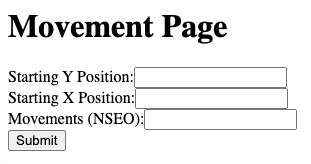
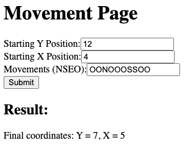

# Adventurer Project
[See instructions page](INSTRUCTIONS.md)  
This project leverages various Symfony components and extensions, including `BrowserKit`, `CSS Selector`, `Doctrine/ORM`, `Form`, `Maker`, `Twig`, `Validator` to achieve different steps.

## Requirements

- [Docker](https://www.docker.com)
- Make (already installed on most Linux distributions and macOS)

## Install
- #### Copy the directory from source code

- Then `cd adventurer`

- The SERVER_NAME value is `localhost` by default.  
If you want, add SERVER_NAME value, located in `.env.file`, in `/etc/hosts` in order to match your docker daemon
machine IP (it should be 127.0.0.1) or use a tool like `dnsmasq` to map the docker daemon to a local tld
(e.g. `.local`).

- Then just run `make install` command and follow instructions.
Run `make help` to display available commands.

## Tests
- Run `make test` command.

## Page previews

